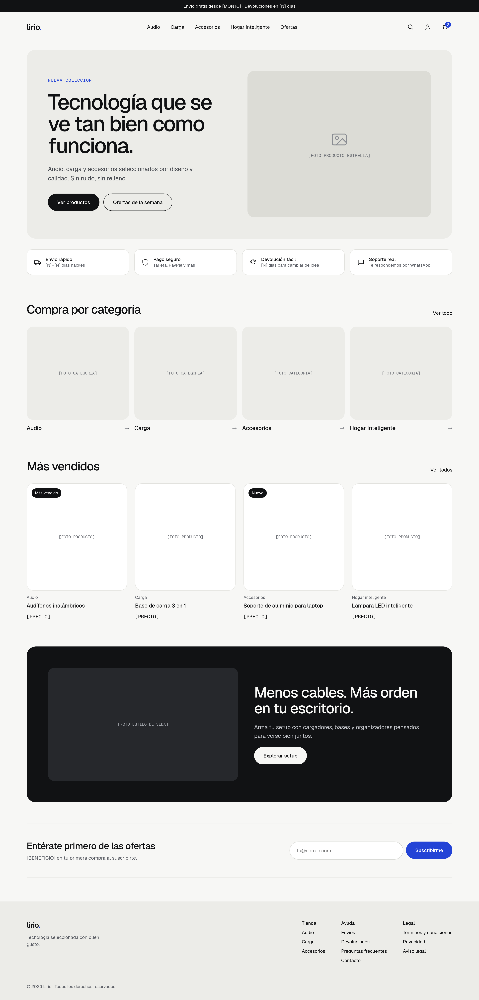

# Lirio

Tienda de tecnología headless construida con Next.js y conectada a Shopify por la Storefront API. El catálogo, la ficha de producto y el carrito viven en este proyecto; el pago ocurre en el checkout de Shopify.

La tienda funciona completa con datos de prueba, sin cuenta de Shopify. Para conectarla a una tienda real basta con cambiar las variables de entorno.



## Funcionalidades

- Inicio con hero, categorías, más vendidos, bloque destacado y newsletter.
- Catálogo por colección y búsqueda, con filtros, orden y "Cargar más". Todo el estado vive en la URL, así que se puede compartir y funciona sin JavaScript.
- Ficha de producto con galería, variantes, recomendaciones y datos estructurados (JSON-LD).
- Carrito con página propia y panel lateral, cambios de cantidad instantáneos, códigos de descuento y barra de envío gratis.
- Varios países: el precio y la moneda dependen del país del visitante (cookie, geolocalización o país por defecto), que se puede cambiar desde el footer.
- Caché de lecturas con Cache Components y revalidación por webhook de Shopify.
- Sitemap, robots, metadatos por página y páginas de error.

## Tecnologías

- Next.js 16 (App Router, Cache Components, Server Actions) y React 19
- TypeScript, Tailwind CSS v4 y Zod
- Shopify Storefront API (GraphQL)
- Vitest, ESLint y Prettier

## Inicio rápido

Requiere Node.js 20.9 o superior.

```bash
npm install
cp .env.example .env.local
npm run dev
```

Abre [http://localhost:3000](http://localhost:3000). Con la configuración por defecto (`COMMERCE_PROVIDER=mock`) la tienda usa los datos de `src/lib/commerce/mock/data.json`. El código de descuento de prueba es `PRUEBA10`. En modo de prueba no hay checkout: "Ir a pagar" muestra un aviso para conectar Shopify.

## Comandos

| Comando                | Descripción                              |
| ---------------------- | ---------------------------------------- |
| `npm run dev`          | Servidor de desarrollo                   |
| `npm run build`        | Build de producción                      |
| `npm run start`        | Sirve el build de producción             |
| `npm run lint`         | ESLint, sin warnings permitidos          |
| `npm run typecheck`    | Genera los tipos de rutas y corre `tsc`  |
| `npm run format`       | Formatea con Prettier                    |
| `npm run format:check` | Verifica el formato sin cambiar archivos |
| `npm test`             | Tests con Vitest                         |

## Variables de entorno

Se validan al arrancar en `src/env.ts`. Un valor vacío cuenta como no definido.

| Variable                          | Obligatoria   | Descripción                                                 |
| --------------------------------- | ------------- | ----------------------------------------------------------- |
| `COMMERCE_PROVIDER`               | No            | `mock` (por defecto) o `shopify`                            |
| `SHOPIFY_STORE_DOMAIN`            | Con `shopify` | Dominio de la tienda, por ejemplo `tu-tienda.myshopify.com` |
| `SHOPIFY_STOREFRONT_ACCESS_TOKEN` | Con `shopify` | Token público de la Storefront API                          |
| `SHOPIFY_API_VERSION`             | Con `shopify` | Versión de la API, por ejemplo `2026-10`                    |
| `SHOPIFY_WEBHOOK_SECRET`          | No            | Secreto para validar los webhooks de revalidación           |
| `SHOPIFY_COUNTRY`                 | No            | País por defecto en ISO de dos letras (por defecto `ES`)    |
| `NEXT_PUBLIC_SITE_URL`            | No            | URL pública del sitio, para el sitemap y las URLs canónicas |

## Conectar Shopify

1. En el admin de Shopify, instala el canal **Headless** y crea un storefront. Copia el token público de la Storefront API.
2. Configura `.env.local`:

   ```bash
   COMMERCE_PROVIDER=shopify
   SHOPIFY_STORE_DOMAIN=tu-tienda.myshopify.com
   SHOPIFY_STOREFRONT_ACCESS_TOKEN=...
   SHOPIFY_API_VERSION=2026-10
   ```

3. Crea estas colecciones (los handles deben coincidir con `src/config/collections.ts`):

   | Handle                                              | Tipo                                             |
   | --------------------------------------------------- | ------------------------------------------------ |
   | `todo`                                              | Automática, con todos los productos              |
   | `mas-vendidos`                                      | Automática, productos con etiqueta `mas-vendido` |
   | `ofertas`                                           | Automática, productos con etiqueta `oferta`      |
   | `audio`, `carga`, `accesorios`, `hogar-inteligente` | Categorías del inicio, con imagen                |

4. Usa estas etiquetas de producto:

   - `mas-vendido`, `nuevo`, `oferta`: muestran una insignia (prioridad Oferta > Nuevo > Más vendido).
   - `oferta`, `envio-rapido`: aparecen como filtros de disponibilidad.

5. Crea estos metacampos de producto (opcionales):

   - `custom.subtitulo` (texto de una línea): subtítulo bajo el nombre del producto.
   - `custom.especificaciones` (JSON o texto multilínea): especificaciones técnicas. Acepta una lista `[{ "label": "Peso", "value": "250 g" }]`, un objeto `{ "Peso": "250 g" }` o líneas `Peso: 250 g`.

6. Los filtros del catálogo salen de la app **Search & Discovery** de Shopify. Cualquier filtro configurado ahí aparece en la tienda; las claves de la URL son el slug de su etiqueta.

7. Activa los países en **Shopify Markets**. La tienda los lista en el selector del footer y muestra el precio y la moneda de cada mercado.

Para probar sin cuenta propia se puede usar `SHOPIFY_STORE_DOMAIN=mock.shop` con cualquier token.

### Revalidación por webhook

Las lecturas del catálogo se cachean durante horas. Para que los cambios en Shopify se vean al momento:

1. Define `SHOPIFY_WEBHOOK_SECRET` con el secreto de firma de los webhooks de tu tienda.
2. En **Configuración > Notificaciones > Webhooks**, crea webhooks en formato JSON hacia `https://tu-dominio/api/revalidate` para los temas `products/create`, `products/update`, `products/delete`, `collections/create`, `collections/update` y `collections/delete`.

La ruta valida la firma HMAC y responde `401` si no coincide, o `503` si el secreto no está configurado.

## Datos del negocio

`src/config/store.ts` guarda el nombre, el eslogan y las políticas de la tienda. Los campos en `null` (plazos de envío, umbral de envío gratis, días de devolución, garantía) están marcados con `TODO` y la interfaz oculta lo que dependa de ellos. Por ejemplo, la barra de anuncio solo aparece cuando están definidos el umbral de envío gratis y los días de devolución.

Los enlaces del footer y las páginas de contenido (`/paginas/[handle]`) se configuran en `src/config/navigation.ts`. Con Shopify, el contenido sale de las páginas de la tienda.

## Arquitectura

```
src/
├── app/                 Rutas: (inicio), (tienda), (compra), api/revalidate, dev/ui
├── components/
│   ├── ui/              Componentes base (Button, Drawer, Price, Picture...)
│   ├── layout/          Header, footer, menú móvil, selector de país
│   ├── catalog/         Vista de catálogo compartida por colecciones y búsqueda
│   ├── product/         Tarjeta, grilla y ficha de producto
│   ├── cart/            Contexto del carrito, página y panel lateral
│   └── home/            Secciones del inicio
├── config/              Datos del negocio, navegación y colecciones
├── lib/
│   ├── commerce/        Capa de datos: interfaz, proveedor mock y proveedor Shopify
│   ├── catalog/         Estado del catálogo en la URL y carga paginada
│   └── actions/         Server Actions (carrito, país, newsletter)
└── env.ts               Validación de variables de entorno
```

### Capa de datos

Los componentes solo importan de `@/lib/commerce`. Ese módulo elige el proveedor según `COMMERCE_PROVIDER` y cachea las lecturas con `'use cache'`, `cacheTag` y `cacheLife`. Ambos proveedores implementan la misma interfaz `CommerceProvider` (`src/lib/commerce/provider.ts`) y devuelven los mismos tipos de dominio (`types.ts`), así que el resto de la aplicación no sabe de dónde vienen los datos.

- **Mock**: datos en JSON validados con Zod. Replica filtros, orden, búsqueda, colecciones automáticas y descuentos. El estado del carrito va codificado en el propio `cartId`, así que no necesita base de datos ni memoria del servidor.
- **Shopify**: consultas GraphQL a la Storefront API con `@inContext(country, language)`. `normalize.ts` traduce las respuestas a los tipos de dominio y tiene tests.

El carrito nunca se cachea. Su id se guarda en una cookie y las mutaciones se hacen con Server Actions.

### Decisiones principales

- **Estado del catálogo en la URL**: `?tipo=audifonos&color=negro&precio_min=10&orden=precio-asc&pagina=2`. Valores repetidos se combinan con OR dentro del grupo y grupos distintos con AND. "Cargar más" es un enlace a la página siguiente; el servidor recorre las páginas con el cursor de Shopify y cada página queda cacheada.
- **Ficha de producto en dos partes**: galería, título y descripción se renderizan con el país por defecto (estático, buen LCP); precio, variantes y compra se cargan en `<Suspense>` con el país del visitante. La variante elegida se refleja en `?variant=` sin ir al servidor.
- **Actualizaciones optimistas**: filtros, orden y cantidades del carrito cambian al instante con `useOptimistic` mientras el servidor confirma.
- **Precios**: siempre con `<Price>` o `formatMoney()`, usando `Intl.NumberFormat("es-419")` con el código de moneda (`USD 19.99`) para evitar ambigüedades entre monedas.
- **Diseño**: colores, tamaños de texto y radios definidos como tokens en `src/app/globals.css` (`@theme` de Tailwind v4), con la paleta por defecto desactivada. La vitrina de componentes está en `/dev/ui`.

## Tests

```bash
npm test
```

Cubren la normalización de respuestas de Shopify, la validación de firmas de webhooks y la lectura y escritura del estado del catálogo en la URL.

## Despliegue

El proyecto se puede desplegar en cualquier plataforma compatible con Next.js. En producción:

- Define las variables de entorno de Shopify y `NEXT_PUBLIC_SITE_URL` con el dominio real.
- La detección del país usa las cabeceras `x-vercel-ip-country` o `cf-ipcountry` cuando la plataforma las envía.
- Configura los webhooks de revalidación.
